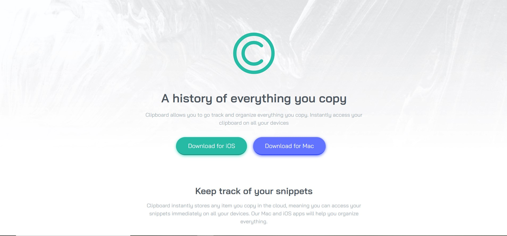

# Frontend Mentor - Clipboard landing page solution

This is a solution to the [Clipboard landing page challenge on Frontend Mentor](https://www.frontendmentor.io/challenges/clipboard-landing-page-5cc9bccd6c4c91111378ecb9). Frontend Mentor challenges help you improve your coding skills by building realistic projects.

## Table of contents

- [Overview](#overview)
  - [The challenge](#the-challenge)
  - [Screenshot](#screenshot)
  - [Links](#links)
- [My process](#my-process)
  - [Built with](#built-with)
- [Author](#author)

## Overview

### The challenge

Users should be able to:

- View the optimal layout for the site depending on their device's screen size
- See hover states for all interactive elements on the page

### Screenshot

### Links

- Solution URL: [Solution](https://www.frontendmentor.io/solutions/clipboard-website-with-html5-and-css3-RFN0UNZfm)
- Live Site URL: [Live Website](https://clipboard-app-website.netlify.app)

## My process

This is my third junior challenge from Frontend Mentor and this is the one I am mostly proud of. I used much more max-width and width so when I was writting media queries I didn't have so much to do. I only added width and some paddings to the items so in my opinion the design and this solution are pretty similar.
Keep working and doing all junior challenges.

### Built with

- Semantic HTML5 markup
- CSS custom properties
- Flexbox
- CSS Grid

## Author

- Frontend Mentor - [@dusanlukic404](https://www.frontendmentor.io/profile/dusanlukic404)
- LinkedIn - [@dusan-lukic](https://www.linkedin.com/in/dusan-lukic)
